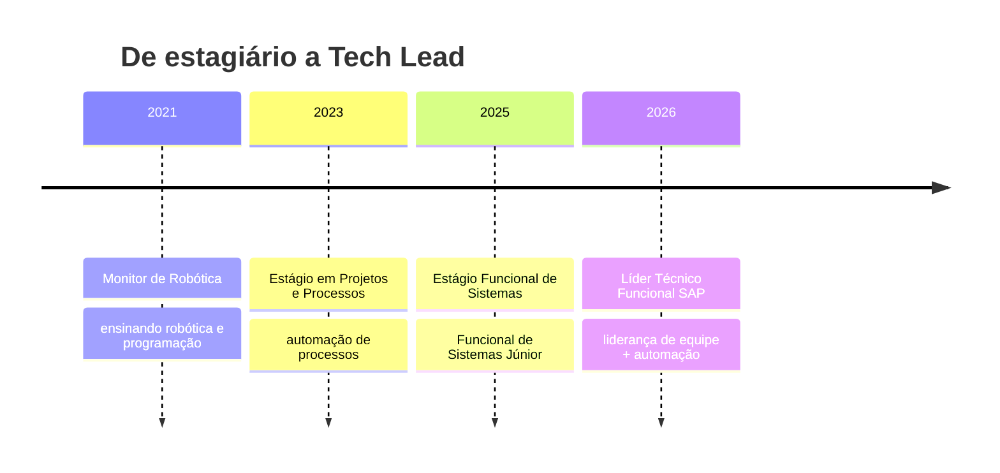

<!-- Cabeçalho animado -->
<div align="center">
  
</div>

<div align="center">
  <a href="https://github.com/gilrjunior">
    
  </a>
</div>

<div align="center">
  
  <a href="https://www.linkedin.com/in/gilmar-dos-reis-j%C3%BAnior-589a0a255/">
    
  </a>
  <a href="mailto:gilmar.junior@estudante.iftm.edu.br">
    
  </a>
  <a href="https://instagram.com/gilrjunior">
    
  </a>
</div>

<br/>

## 👋 Sobre mim

```python
class GilmarJunior:
    def __init__(self):
        self.nome     = "Gilmar dos Reis Júnior"
        self.formacao = "Engenharia de Computação — IFTM, Campus Avançado Uberaba Parque Tecnológico"
        self.local    = "Uberaba - MG 🇧🇷"
        self.cargo    = "Tech Lead · Líder Técnico Funcional SAP"
        self.foco     = ["Integrações SAP", "Automação de processos", "Liderança técnica"]
        self.paixoes  = ["Inteligência Artificial", "Otimização", "Automação"]

    def dizer_oi(self):
        return "Bora construir algo legal? 🚀"
```

- 🎓 **Engenheiro de Computação** formado pelo **IFTM** (Instituto Federal do Triângulo Mineiro)
- 🧭 **Tech Lead** de um time funcional **SAP**: fui de estagiário a líder técnico em pouco mais de 2 anos
- 💼 Atuo com **integrações SAP**: consultoria funcional (SD/MM/J1BTAX), **ABAP**, análise de payloads (JSON/XML) e **automação de processos**
- 🧠 Apaixonado por **IA clássica**: algoritmos genéticos, redes neurais (MLP, CNN, Madaline) e lógica fuzzy
- ⚙️ Gosto de entender como as coisas funcionam por baixo: protocolos, payloads e o que acontece dentro do ERP
- 🐍 **Python** e **Ruby on Rails** no dia a dia, e circulo bem entre **Java**, **JavaScript/TypeScript** e **ABAP**
- 🎤 Curto falar em público: cursos de **oratória**, **apresentações de alto impacto** e **gestão ágil de projetos**

<br/>

## 🧭 Trajetória



<details>
<summary><b>📜 Certificações</b> — clique para ver</summary>
<br/>

| Certificação | Emissor | Quando |
| :-- | :-- | :--: |
| 🏅 Managing Clean Core for SAP S/4HANA Cloud — Record of Achievement | SAP | out/2025 |
| 🏅 Learning the Basics of ABAP Programming on SAP BTP — Record of Achievement | SAP | set/2025 |
| 🏅 Combo SAP SD + MM + J1BTAX | Udemy | ago/2025 |
| 🎤 Oratória e Palestra de Alto Impacto | Udemy | out/2024 |
| 📋 Técnicas ágeis para gestão de projetos | Escola Conquer | abr/2024 |
| 🎯 Apresentações que conquistam | Escola Conquer | nov/2023 |

</details>

<br/>

## 🧰 Stack

<div align="center">

**Linguagens**


**IA & Dados**


**Web & Backend**


**ERP & Integrações**


**Ferramentas**


</div>

<br/>

## 🚀 Projetos em destaque

<details open>
<summary><b>🧬 Inteligência Artificial</b> — clique para expandir</summary>
<br/>

| Projeto | Descrição | Tech |
| :-- | :-- | :--: |
| [🗓️ Gerador de grade horária](https://github.com/gilrjunior/genetic_algorithm_timetable_generator_AI) | Algoritmo genético que monta grades horárias sem conflito de professores, turmas e salas |  |
| [🗺️ Caixeiro viajante (TSP)](https://github.com/gilrjunior/tsp_genetic_algorithm_AI) | Solução aproximada do TSP com seleção, crossover e mutação |  |
| [📈 Maximizador de funções](https://github.com/gilrjunior/genetic_algorithm_function_maximizer_AI) | Encontra máximos de funções com algoritmo genético |  |
| [🖼️ Reconhecimento de imagens (CNN)](https://github.com/gilrjunior/image_recognition_with_convolutional_neural_network_AI) | Rede neural convolucional para classificação de imagens |  |
| [✍️ Dígitos manuscritos (MLP)](https://github.com/gilrjunior/handwritten_digit_recognition_multilayer_perceptron_AI) | Perceptron multicamadas reconhecendo dígitos escritos à mão |  |
| [📐 Aproximação de funções (MLP)](https://github.com/gilrjunior/function_approximation_multilayer_perceptron_AI) | MLP aprendendo a aproximar funções matemáticas |  |
| [🔤 Reconhecedor de letras (Madaline)](https://github.com/gilrjunior/madaline-letter-recognizer-AI) | Rede Madaline reconhecendo letras |  |
| [🌫️ Lógica Fuzzy](https://github.com/gilrjunior/fuzzy) | Sistema de inferência fuzzy |  |
| [⚽ Escartola GA](https://github.com/gilrjunior/escartola_ga_ai) | Algoritmo genético escalando o time ideal do Cartola FC |  |

</details>

<details>
<summary><b>🛠️ Outros projetos</b> — compiladores, web e automação</summary>
<br/>

| Projeto | Descrição | Tech |
| :-- | :-- | :--: |
| [⚙️ Compiladores](https://github.com/gilrjunior/compiladores) | Analisador léxico, sintático e semântico construído na disciplina de Compiladores |  |
| [🃏 Calculadora Joker](https://github.com/gilrjunior/calculadora_joker) | Calculadora web com uma pegada diferente |  |
| [🏕️ Basecamp Script](https://github.com/gilrjunior/basecamp_script) | Automação com a API do Basecamp |  |
| [🍽️ MVP Restaurante](https://github.com/gilrjunior/mvp_restaurante) | MVP de sistema para restaurante |  |
| [🔗 Case Integração](https://github.com/gilrjunior/caseintegracao) | Estudo de caso de integração entre sistemas |  |
| [✅ To-do List Rails](https://github.com/gilrjunior/todo_list_rails) | Lista de tarefas em Ruby on Rails |  |
| [📱 Avaliação Kotlin](https://github.com/gilrjunior/avaliacao_kotlin) | App Android em Kotlin |  |

</details>

<br/>

## 📊 Estatísticas

<div align="center">
  
</div>

<div align="center">
  
  
</div>

<div align="center">
  
  
</div>

<div align="center">
  
</div>

<br/>

## 🐍 A cobra que come meus commits

<div align="center">
  <picture>
    <source media="(prefers-color-scheme: dark)" srcset="https://raw.githubusercontent.com/gilrjunior/gilrjunior/output/github-snake-dark.svg" />
    <source media="(prefers-color-scheme: light)" srcset="https://raw.githubusercontent.com/gilrjunior/gilrjunior/output/github-snake.svg" />
    
  </picture>
</div>

<br/>

## 📫 Vamos conversar?

<div align="center">

Curte IA, integrações ou só quer trocar uma ideia sobre código? Me chama! 👇

<a href="https://www.linkedin.com/in/gilmar-dos-reis-j%C3%BAnior-589a0a255/">
  
</a>
<a href="mailto:gilmar.junior@estudante.iftm.edu.br">
  
</a>
<a href="https://instagram.com/gilrjunior">
  
</a>

</div>

<div align="center">
  
</div>
